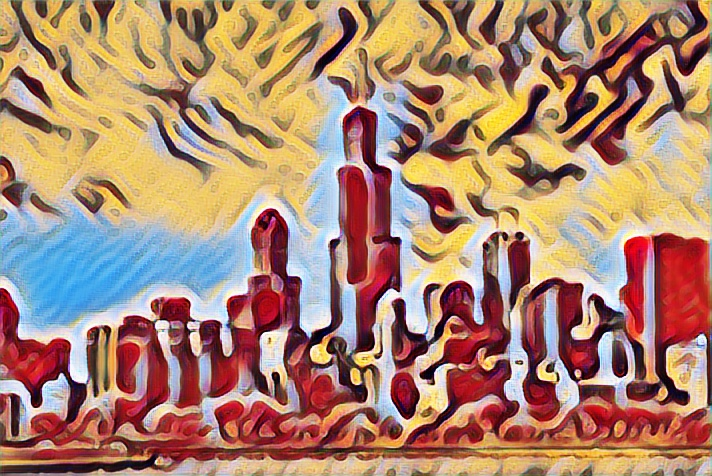

# faststyle
This repository is a Tensorflow implementation of fast neural style transfer, a method by which the content of one image can be fused with the style of another image. It is based upon JC Johnson et al.s' fast style transfer [paper](https://arxiv.org/abs/1603.08155) combined with D. Ulyanov et al.s' instance normalization
[paper](https://arxiv.org/abs/1607.08022). It also provides resize-convolution on top of deconvolution for better upsampling as discussed [here](http://distill.pub/2016/deconv-checkerboard/).

The pretrained models in ```faststyle/models``` were used to generate the results below:
<div align='center'>
  
  
</div>
using neural networks trained with style images (borrowed from Johnson's [repo](https://github.com/jcjohnson/fast-neural-style)):
<div align='center'>
  
  
</div>
and then forward passing through these trained nets an image of Chicago (also borrowed from Johnson):
<div align='center'>
  
</div>

## Dependencies

- Python 2.7
- Tensorflow 1.0.0 (If training: with GPU support + CUDA + cuDNN recommended)
- Numpy
- OpenCV 3.1.0\*

\*This dependency can be easily switched to your favourite image I/O library by tweaking the wrapped functions in ```utils.py```. Note it's still needed for ```stylize_webcam.py```.

## Setup

If you just intend to utilize the pretrained models, then all you need to do is:
```
git clone https://github.com/ghwatson/faststyle.git
```
If you also intend to train new models, you will need the MS-Coco 13GB training dataset found [here](http://mscoco.org/dataset/#download) and the VGG weights by running:

```
cd faststyle/libs
./get_vgg16_weights.sh
```

To prepare the MS-Coco dataset for use with ```train.py```, you will have to convert it to Tensorflow's TFRecords format, which shards the images into large files for more efficient reading from disk. ```tfrecords_writer.py``` can be used for this as shown below. Change ```--num_threads``` to however many threads your cores can handle, and ensure that it divides whatever you choose for ```--train_shards```. This block will give shards ~100MB in size:

```
python tfrecords_writer.py --train_directory /path/to/training/data \
                           --output_directory /path/to/desired/tfrecords/location \
                           --train_shards 126 \
                           --num_threads 6
```

## Usage

Following are examples of how the scripts in this repo can be used. Details on all available options can be viewed by typing ```python stylize_image.py -h``` into your terminal (replacing with script of interest).

### ```stylize_image.py```

Stylize an image with a trained model (created with ```train.py```). Example usage:
```
python stylize_image.py --input_img_path ./results/chicago.jpg \
                        --output_img_path ./out.jpg \
                        --model_path ./models/starry_final.ckpt
```

### ```stylize_webcam.py```

Opens up the webcam feed in a window and stylizes it frame-by-frame. Hit ```q``` to quit. Example usage:
```
python stylize_webcam.py --model_path ./models/starry_final.ckpt \
                         --resolution 800 600
```

### ```train.py```

Creates a trained neural net that can be used to stylize images. Tensorboard logs of the loss functions and checkpoints of the model are also created. Note that this will take a long time to get a good result. Example usage:
```
python train.py --train_dir path/to/mscoco/tfrecords \
                --style_img_path ./style_images/starry_night_crop.jpg \
                --model_name starrynight \
                --n_epochs 2 \
                --batch_size 4 \
                --content_weights 0.5 \
                --style_weights 5.0 5.0 5.0 5.0 \
                --style_target_resize 0.5
```
Before being able to use this, ensure the appropriate steps were taken in the Setup section.

### ```slow_style.py```

Johnson et al.'s work sits upon Gatys et al.'s [A Neural Algorithm of Artistic Style](https://arxiv.org/abs/1508.06576). ```slow_style.py``` implements a version of this (keep in mind the Gatys et al. version originally used VGG19). With the original algorithm, it takes much longer to stylize an image, but does not require the lengthy training process. It also often produces better looking results. ```slow_style.py``` is useful for prototyping various styles and hyperparameters before committing to a model with ```train.py```, though again keep in mind the results will not be the same. Example usage:
```
python slow_style.py --style_img_path ./style_images/starry_night_crop.jpg \
                     --cont_img_path ./results/chicago.jpg \
                     --output_img_path ./slow_out.jpg \
                     --content_weights 1.0 \
                     --style_weights 5.0 5.0 5.0 5.0 \
                     --beta 1.e-4 \
                     --learn_rate 1.e1 \
                     --num_steps_break 1000 \
                     --style_target_resize 0.5
```

## Acknowledgements

For the most part, I implemented this repo by using the aforementioned references, as well as Tensorflow's documentation (this was a learning exercise). Furthermore:
- Justin Johnson's [repo](https://github.com/jcjohnson/fast-neural-style) for its documentation, and example images.
- [hzy46/fast-neural-style-tensorflow](https://github.com/hzy46/fast-neural-style-tensorflow) to squash a few bugs.
- Davi Frossard's [VGG16 Tensorflow implementation](https://www.cs.toronto.edu/~frossard/post/vgg16/).
